# Neural Networks

TensorFlow Playground: [click here](https://playground.tensorflow.org/#activation=tanh&batchSize=30&dataset=xor&regDataset=reg-plane&learningRate=0.03&regularizationRate=0&noise=40&networkShape=4,2&seed=0.05981&showTestData=false&discretize=false&percTrainData=60&x=true&y=true&xTimesY=false&xSquared=false&ySquared=false&cosX=false&sinX=false&cosY=false&sinY=false&collectStats=false&problem=classification&initZero=false&hideText=false)

## Introduction

In the past 10 years, the best-performing artificial-intelligence systems — such as the speech recognizers on smartphones or Google’s latest automatic translator — have resulted from a technique called “Deep Learning.”

Deep learning is in fact a new name for an approach to artificial intelligence called neural networks, which have been going in and out of fashion for more than 70 years. **Neural networks** were first proposed in 1944 by Warren McCullough and Walter Pitts.

**Neural network** is an interconnected group of nodes, inspired by a simplification of neurons in a brain. It works similarly to the human brain’s neural network. A “neuron” in a neural network is a mathematical function that collects and classifies information according to a specific architecture. The network bears a strong resemblance to statistical methods such as curve fitting and regression analysis. 

**In this course**, we’ll understand how neural networks work while implementing one from scratch in Python.

In the previous chapter, we have already learned one of the Data Science Utilities `numpy` from [25 exercises to get familiar with Numpy](https://pyml.aspires.cc/chapter2/data-science-utilities). Since you have learned it yet, we have enough knowledge to learn how to **implement** a Neural Network only using `numpy`. This lecture is inspired from [VictorZhou's Blog](victorzhou.com). 

## Neuron

### Biology Stuffs

In field of study in **Neuroscience and Biology**, scientists have already built the model of a Neuron (Nerve cell) in creatures brains. a Neuron is illustrated as follow:

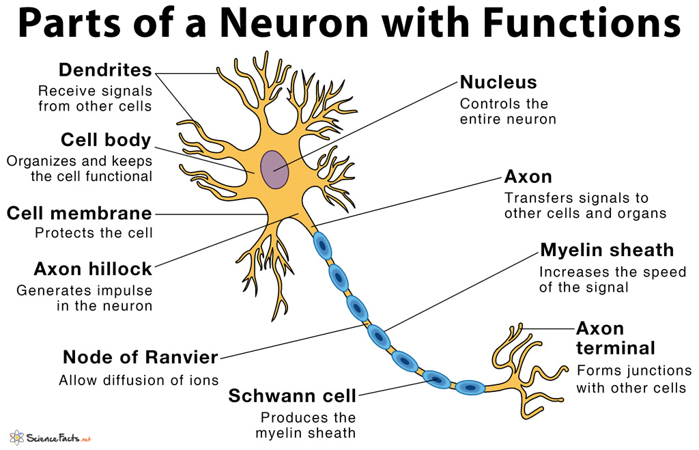

Now focus on these 3 components:

* **Dendrites(树突)**: Receive signals from other cells.
* **Axon hillock(轴丘)**: Generates impulse in the neuron.
* **Axon terminal(轴突末梢)**: Forms junctions with other cells.

At the **Dendrites(树突)**, **neurotransmitters(神经递质)** are released, triggering **nerve impulse(神经冲动)** in neighboring neurons. When the neighboring nerve cell(s) receives a specific impulse, the cell body will be **activated** and **transmit electronic signal** through the **Axon(轴突)** by the effect of exchanging electrons with **Na+/K+-ATPase(Na/K泵)**.

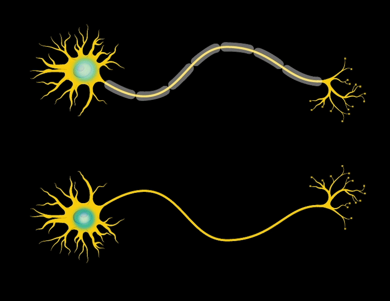

Remember, a neuron is always connected to many other neighboring neurons in the **Axon terminal(轴突末梢) side**, meanwhile; a neuron can also receive impluse from previous neurons in the **Dendrites(树突) side**. As an example:

### Metaphor: Interpersonal Relationship

> There is a boy called Tom, he has a simple **interpersonal relationship** described as the following picture:
>
> 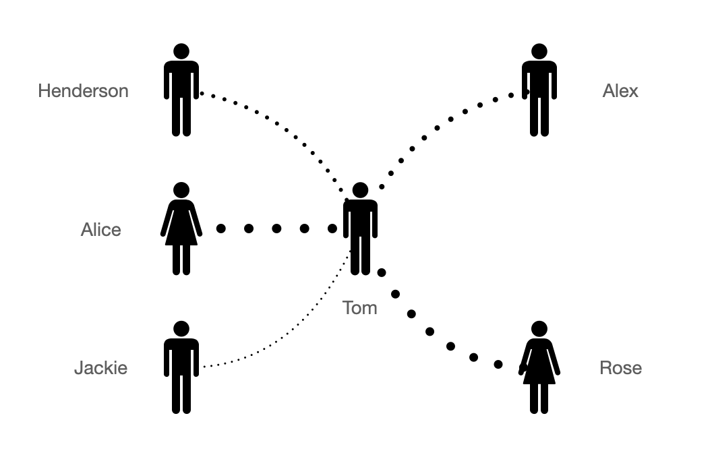
>
> **Henderson and Alice** are Tom's good friends while **Jackie** is Tom's colleague, it is clear that Tom will arrange higher priorities with affairs from Henderson and Alice, and a lower priorities to Jackie. Relatively, **Rose** regards Tom as good friend so when Tom tells Rose something, she will be more active than **Alex** in helping Tom. 
>
> Years later, with the co-operation with Jackie, Tom and Jackie will be more close and be good friend, they talk to each other everything. So the connection between Jackie and Tom will the stronger, and Tom will arrange higher priorities to Jackie.
>
> Tom also have a **threshold** on which kind of people he can help and which kind of people he will reject. Meanwhile, the **threshold** is always changing for each people. Maybe someday, Tom and Alice have not communicated with each other for several month, and Tom will regards Alice not as close as before, so he will adjust the **threshold**.

Back to neurons, the relationships is similar. With multiple neurons work as the **interpersonal relationship**, they are forming a network like **social networks**. And that is why our brains can think, action and create as well as having emotion.

Now let us model the **working principle** of neurons with programming language. Image a function which can take two input parameters as **x1, x2** and returns output **y**. In Python code:

```python
def f(x1, x2):
  ...
  return y
```

The implementation `...` of the function are in three steps:

1. Calculate **weighted** x1 and x2
2. Add a **bias** to adjust the **weighted value** from <u>step 1</u>
3. Determine in what extents we can **accept** the value from <u>step 2</u>

To illustrate the implementation, we have:

```python
def f(x1, x2):
  w = w1 * x1 + w2 * x2
  expr = w + b
  y = activation(expr)
  return y
```

Note that, **weights** w1, w2 and **bias** b can be changed during the time. And `accept_level` can be considered as the **threshold** to determine how much **y** will be.

This function works as a **neuron** which we have introduced before. There will be many neurons interconnected as a network.

In this example, we regards:

* **x1, x2** as the output from the previous neuron.
* **y** as the output of current function.
* `activation()` is the activation function which used to turn an unbounded input into an output that has a nice, predictable form.

### Activation Function

> ### Activation function
>
> Consider a classification problem: You are taking a test at school, if your test mark is lower than **50**, your mama will **beat you** when you back home. Otherwise, she will **treate you a delicious dinner(请你吃顿好的)**, we can consider
>
> * `x = your mark - 50`
> * when x is positive, you will have a delicious dinner
> * when x is negative, you will be beaten by mama
>
> That is the following diagram:
>
> 
>
> * `y = 1` means you have dinner
> * `y = 0` means you got beat
>
> But it is not fair for your score is around 50, which means only 1 mark difference will **make you be in two results**. Why not make the line smooth, and when you got whatever 49 or 51 your mama will just say: It's okay, be better next time.
>
> <u>**Sigmoid activation function**</u> works well in this scenario:
>
> 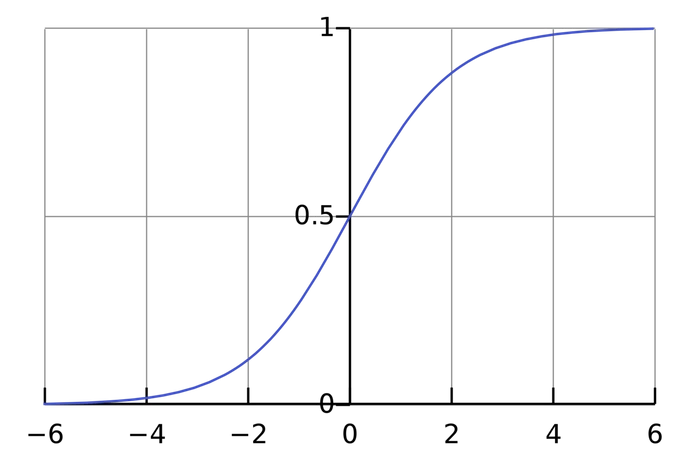
>
> Back to the activation function, actually there are many kinds of functions and they work well in different senarios.
>
> 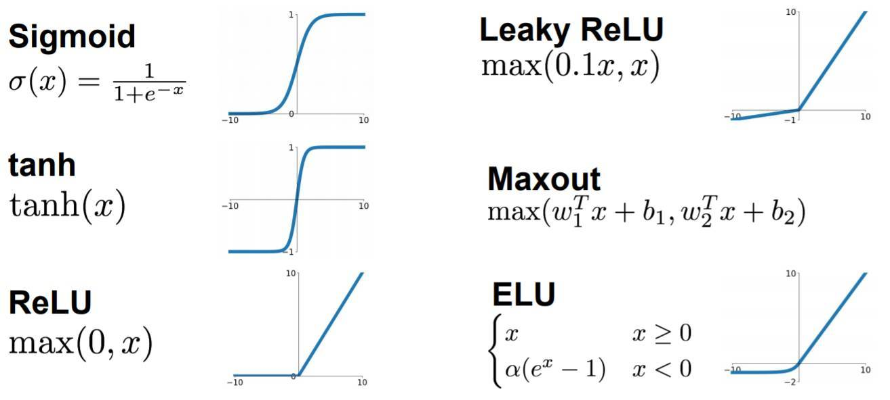

### Coding Neuron

In order to manage the relationship well. We can make a `Neuron` class to struturalize a neuron unit. In which, the `feedforward()` function is the previous `f(x1, x2)`. And inner implementation of the `f()` function changes in order to get **vector input** `inputs`, so it will be `np.dot()` instead of `w1 * x1 + w2 * x2`. If you are not familiar with dot product, please refer: [Dot product in Wiki](https://simple.wikipedia.org/wiki/Dot_product).

```python
def sigmoid(x):
  # Activation function: f(x) = 1 / (1 + e^(-x))
  return 1 / (1 + np.exp(-x))

class Neuron:
  def __init__(self, weights, bias):
    self.weights = weights
    self.bias = bias
    
  def feedforward(self, inputs):
    # Weight inputs, add bias, then use the activation function
    total = np.dot(self.weights, inputs) + self.bias
    return sigmoid(total)
```

## Neuron Network

A neural network is nothing more than a bunch of neurons connected together. Here’s what a simple neural network might look like:

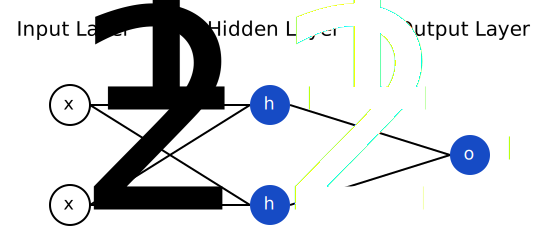

This network has 2 inputs, a **hidden layer** with 2 neurons (**h1** and **h2**), and an **output layer** with 1 neuron (**o1**). Notice that the inputs for **o1** are the outputs from **h1** and **h2** - that’s what makes this a network. In addition, **h1, h2, o1** are all **instances** of class Neuron.

> *A* **hidden layer** is any layer between the input (first) layer and output (last) layer. There can be multiple hidden layers!

### Feed-forward

We assumed that all of the Neurons (h1, h2, o1) have the same weights `w = [0, 1]` and bias `b = 0`. Then if we pass input `x1 = 2, x2 = 3` into the network. We have:

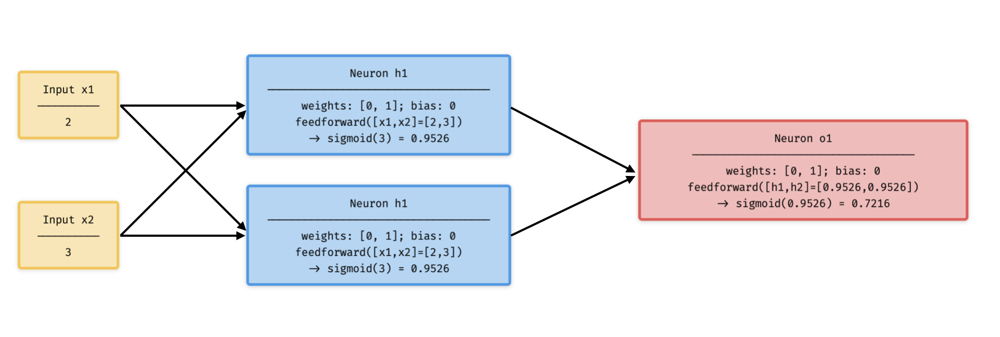

A neural network can have **any number of layers** with **any number of neurons** in those layers. The basic idea stays the same: feed the input(s) forward through the neurons in the network to get the output(s) at the end.

### Coding Feed-forward

Here is the code implementing the previous feedforward process of our neural network.

```python
import numpy as np

def sigmoid():
  # Omitted...

class Neuron:
  # Omitted...
  
class OurNeuralNetwork:
  '''
  A neural network with:
    - 2 inputs
    - a hidden layer with 2 neurons (h1, h2)
    - an output layer with 1 neuron (o1)
  Each neuron has the same weights and bias:
    - w = [0, 1]
    - b = 0
  '''
  def __init__(self):
    weights = np.array([0, 1])
    bias = 0

    # The Neuron class here is from the previous section
    self.h1 = Neuron(weights, bias)
    self.h2 = Neuron(weights, bias)
    self.o1 = Neuron(weights, bias)

  def feedforward(self, x):
    out_h1 = self.h1.feedforward(x)
    out_h2 = self.h2.feedforward(x)

    # The inputs for o1 are the outputs from h1 and h2
    out_o1 = self.o1.feedforward(np.array([out_h1, out_h2]))

    return out_o1

network = OurNeuralNetwork()
x = np.array([2, 3])
print(network.feedforward(x)) # 0.7216325609518421
```

We got the same result compared with the illustrated diagram in Feed-Forward section.

### Training a Neural Network (Part 1)

Say we have the following measurements:

| Name    | Weight (lb) | Height (in) | Gender |
| ------- | ----------- | ----------- | ------ |
| Alice   | 133         | 65          | F      |
| Bob     | 160         | 72          | M      |
| Charlie | 152         | 70          | M      |
| Diana   | 120         | 60          | F      |

Let’s train our network to predict someone’s gender given their weight and height:

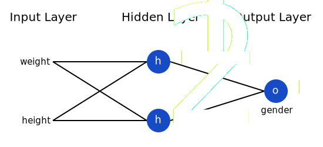

We’ll represent Male with a 0 and Female with a 1, and we’ll also shift the data to make it easier to use:

make it easier to use:

| Name    | Weight (minus 135) | Height (minus 66) | Gender |
| ------- | ------------------ | ----------------- | ------ |
| Alice   | -2                 | -1                | 1      |
| Bob     | 25                 | 6                 | 0      |
| Charlie | 17                 | 4                 | 0      |
| Diana   | -15                | -6                | 1      |

> I arbitrarily chose the shift amounts (135 and 66) to make the numbers look nice. Normally, you’d shift by the mean.
>
> The process making data more easier to use follows the methodology of **Normalization**.
>
> 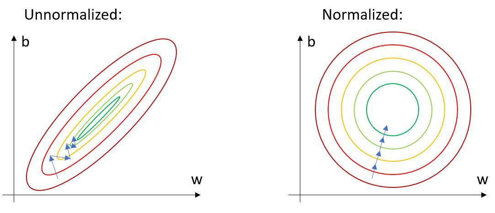

#### Linear Regression

Before we start the training process, let's have a quick review on **Linear Regression**:


Consider a plot of scatter points `(x_i, y_i)`which repectively represents `(rental price, house area)`. As common sense, the **x** and **y** has a positive correlation. We can plug in each **x_i** and **y_i** into the formula of **Least Squares Method**:

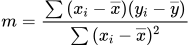

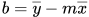

Where `m` called **correlation coefficient** and the equation of the regression line is:

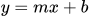

For linear regression, we can get the equation easily. But for **Multiple Linear Regression** with many parameter **x**'s, it will become complex.


And we know that, to predict the **house rental price**, we cannot consider only one factor which is house area. We should also take **Location**, **Number of Bedrooms**, **Appliances and Other Amenities**, **Curb Appeal and Condition** and even if the house is **Allowing Pets**. Then the regression process will be further more complex. So we should determine another method to optimize the calculating time. 

#### Loss

Let us have a look at a common component of regression. We know that any of the avaliable regression cannot pass through all of the points of (x, y). There may be many points below line or on the upwards. So the **Loss** is defined to describe the regression's level of inaccurate.

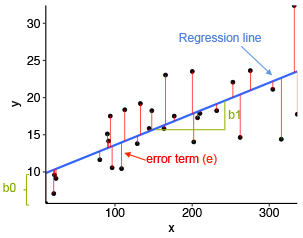

The **red lines** describe absolute value of `y_accurate - y_predict`. As an example, we use the **mean squared error** (MSE) loss:

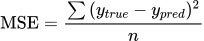

Turn this formula to Python code is straightforward:

```python
import numpy as np

def mse_loss(y_true, y_pred):
  return ((y_true - y_pred) ** 2).mean()

y_true = np.array([1, 0, 0, 1])
y_pred = np.array([0, 0, 0, 0])

print(mse_loss(y_true, y_pred)) # 0.5
```

#### Gradient Descent

Assume that The **z** axis (height) is the loss, **x** and **y** are the correlation coeffiecients of a **Multiple Linear Regression**. There may be a 3D plot as follows.

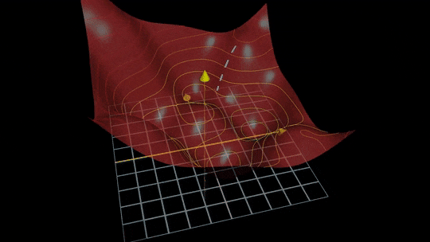

To get the optimized regression effect. We should determine the **lowest z** on the plot and the coefficients are the corresponding **x** and **y**. If we can get this plot, we can easily find where is the **lowest z**.

Unfortunately, in practice, like playing a open-world game. It always has fog covering the unvisited area. We only have the information of starting up point, and we need to try each direction to explore. 


But, at least, we may know where to go like: **try not going to the desert at first.**

Same as calculating the **optimized correlation coefficient**. Although we do not know all of the map, we can refer to the gradient where we are standing on. We can refer **gradient(梯度)** as **slope(斜率)** in higher dimension plot. As the following animation illustrated, if we want to go to the lower place, we should follow the current gradient:

> **Positive** gradient: go **Left**
>
> **Negative** gradient: go **Right**

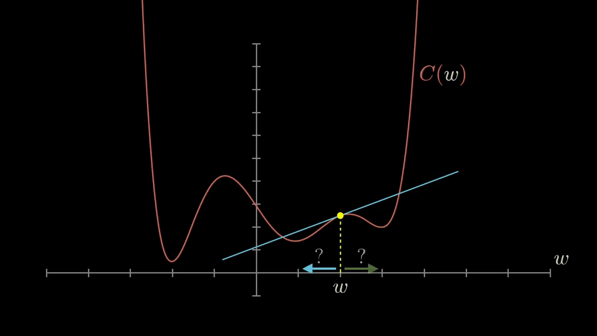

### Training a Neural Network (Part 2)

We now have a clear goal: **minimize the loss** of the neural network. We know we can change the network’s **weights** and **biases** (each weights and bias in a Neuron) to influence its predictions, but how do we do so in a way that decreases loss?

To think about loss is as a function of weights and biases. Let’s label each weight and bias in our network:


Then the loss of the whole Network are determined by weight and bias in each Neurons:

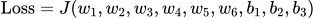

#### Backpropagation

If we want to make **w1** a little bit higher or lower, how would **Loss** change? The loss is the function of every weights and biases. So we need to calculate the gradient of the 2D slice `(x, y) = (w1, L)` of a 9D plot is [partial derivative](https://simple.wikipedia.org/wiki/Partial_derivative) 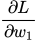.

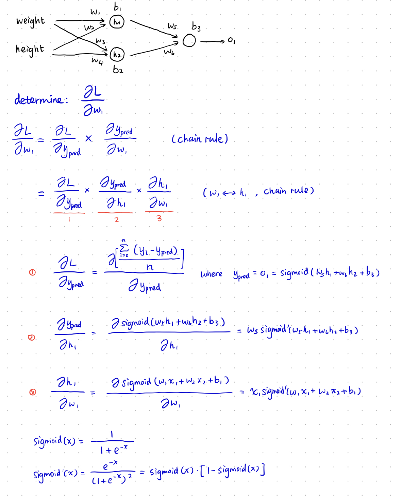

This system of calculating partial derivatives by working backwards is known as **backpropagation**, or “backprop”.

#### Optimizer

**We have all the tools we need to train a neural network now!** We’ll use an optimization algorithm called [stochastic gradient descent](https://en.wikipedia.org/wiki/Stochastic_gradient_descent) (SGD) that tells us how to change our weights and biases to minimize loss. It’s basically just this update equation:

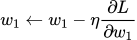

η is a constant called the **learning rate** that controls how fast we train. We use η times to adjusting **w1**:

* if  is positive, according to SGD **w1** will decrease, `L = f(w1)` is **decrescent function**, **L** will decrease
* if  is negative, according to SGD, **w1** will increase, `L = f(w1)` is **increasing function**, **L** will decrease

If we do this for every weight and bias in the network, the loss will slowly decrease and our network will improve.

Our training process will look like this:

1. Choose **one** sample from our dataset. This is what makes it *stochastic*gradient descent - we only operate on one sample at a time.
2. Calculate all the partial derivatives of loss (example using , but we need to find **all w and b**) with respect to **weights** or **biases** 
3. Use the update equation to update each **weight** and **bias**.
4. Go back to step 1.

Implementing with Python is, we refer each **w** and **b** is random:

```python
import numpy as np

def sigmoid(x):
  # Sigmoid activation function: f(x) = 1 / (1 + e^(-x))
  return 1 / (1 + np.exp(-x))

def deriv_sigmoid(x):
  # Derivative of sigmoid: f'(x) = f(x) * (1 - f(x))
  fx = sigmoid(x)
  return fx * (1 - fx)

def mse_loss(y_true, y_pred):
  # y_true and y_pred are numpy arrays of the same length.
  return ((y_true - y_pred) ** 2).mean()

class OurNeuralNetwork:
  '''
  A neural network with:
    - 2 inputs
    - a hidden layer with 2 neurons (h1, h2)
    - an output layer with 1 neuron (o1)

  *** DISCLAIMER ***:
  The code below is intended to be simple and educational, NOT optimal.
  Real neural net code looks nothing like this. DO NOT use this code.
  Instead, read/run it to understand how this specific network works.
  '''
  def __init__(self):
    # Weights
    self.w1 = np.random.normal()
    self.w2 = np.random.normal()
    self.w3 = np.random.normal()
    self.w4 = np.random.normal()
    self.w5 = np.random.normal()
    self.w6 = np.random.normal()

    # Biases
    self.b1 = np.random.normal()
    self.b2 = np.random.normal()
    self.b3 = np.random.normal()

  def feedforward(self, x):
    # x is a numpy array with 2 elements.
    h1 = sigmoid(self.w1 * x[0] + self.w2 * x[1] + self.b1)
    h2 = sigmoid(self.w3 * x[0] + self.w4 * x[1] + self.b2)
    o1 = sigmoid(self.w5 * h1 + self.w6 * h2 + self.b3)
    return o1

  def train(self, data, all_y_trues):
    '''
    - data is a (n x 2) numpy array, n = # of samples in the dataset.
    - all_y_trues is a numpy array with n elements.
      Elements in all_y_trues correspond to those in data.
    '''
    learn_rate = 0.1
    epochs = 1000 # number of times to loop through the entire dataset

    for epoch in range(epochs):
      for x, y_true in zip(data, all_y_trues):
        # --- Do a feedforward (we'll need these values later)
        sum_h1 = self.w1 * x[0] + self.w2 * x[1] + self.b1
        h1 = sigmoid(sum_h1)

        sum_h2 = self.w3 * x[0] + self.w4 * x[1] + self.b2
        h2 = sigmoid(sum_h2)

        sum_o1 = self.w5 * h1 + self.w6 * h2 + self.b3
        o1 = sigmoid(sum_o1)
        y_pred = o1

        # --- Calculate partial derivatives.
        # --- Naming: d_L_d_w1 represents "partial L / partial w1"
        d_L_d_ypred = -2 * (y_true - y_pred)

        # Neuron o1
        d_ypred_d_w5 = h1 * deriv_sigmoid(sum_o1)
        d_ypred_d_w6 = h2 * deriv_sigmoid(sum_o1)
        d_ypred_d_b3 = deriv_sigmoid(sum_o1)

        d_ypred_d_h1 = self.w5 * deriv_sigmoid(sum_o1)
        d_ypred_d_h2 = self.w6 * deriv_sigmoid(sum_o1)

        # Neuron h1
        d_h1_d_w1 = x[0] * deriv_sigmoid(sum_h1)
        d_h1_d_w2 = x[1] * deriv_sigmoid(sum_h1)
        d_h1_d_b1 = deriv_sigmoid(sum_h1)

        # Neuron h2
        d_h2_d_w3 = x[0] * deriv_sigmoid(sum_h2)
        d_h2_d_w4 = x[1] * deriv_sigmoid(sum_h2)
        d_h2_d_b2 = deriv_sigmoid(sum_h2)

        # --- Update weights and biases
        # Neuron h1
        self.w1 -= learn_rate * d_L_d_ypred * d_ypred_d_h1 * d_h1_d_w1
        self.w2 -= learn_rate * d_L_d_ypred * d_ypred_d_h1 * d_h1_d_w2
        self.b1 -= learn_rate * d_L_d_ypred * d_ypred_d_h1 * d_h1_d_b1

        # Neuron h2
        self.w3 -= learn_rate * d_L_d_ypred * d_ypred_d_h2 * d_h2_d_w3
        self.w4 -= learn_rate * d_L_d_ypred * d_ypred_d_h2 * d_h2_d_w4
        self.b2 -= learn_rate * d_L_d_ypred * d_ypred_d_h2 * d_h2_d_b2

        # Neuron o1
        self.w5 -= learn_rate * d_L_d_ypred * d_ypred_d_w5
        self.w6 -= learn_rate * d_L_d_ypred * d_ypred_d_w6
        self.b3 -= learn_rate * d_L_d_ypred * d_ypred_d_b3

      # --- Calculate total loss at the end of each epoch
      if epoch % 10 == 0:
        y_preds = np.apply_along_axis(self.feedforward, 1, data)
        loss = mse_loss(all_y_trues, y_preds)
        print("Epoch %d loss: %.3f" % (epoch, loss))
```

Then we input some train data from the following table.

| Name    | Weight (minus 135) | Height (minus 66) | Gender |
| ------- | ------------------ | ----------------- | ------ |
| Alice   | -2                 | -1                | 1      |
| Bob     | 25                 | 6                 | 0      |
| Charlie | 17                 | 4                 | 0      |
| Diana   | -15                | -6                | 1      |

```python
# Define dataset
data = np.array([
  [-2, -1],  # Alice
  [25, 6],   # Bob
  [17, 4],   # Charlie
  [-15, -6], # Diana
])
all_y_trues = np.array([
  1, # Alice
  0, # Bob
  0, # Charlie
  1, # Diana
])

# Train our neural network!
network = OurNeuralNetwork()
network.train(data, all_y_trues)
```

Our loss steadily decreases as the network learns:

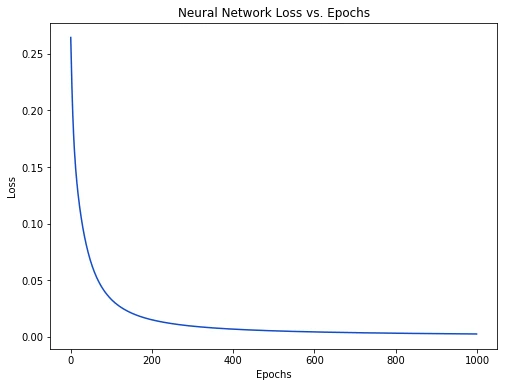

We can now use the network to predict genders:

```python
# Make some predictions
emily = np.array([-7, -3]) # 128 pounds, 63 inches
frank = np.array([20, 2])  # 155 pounds, 68 inches
print("Emily: %.3f" % network.feedforward(emily)) # 0.951 - F
print("Frank: %.3f" % network.feedforward(frank)) # 0.039 - M
```

Try your personal data:

```python
def generate_test_data(kg, cm):
  lbs = kg * 2.20462
  inch = cm * 0.393701
  return np.array([lbs - 135, inch - 66])

steve = generate_test_data(182, 73)
print("Steve: %.3f" % network.feedforward(steve)) # 0.040 - M
```

## Conclusion

You made it! A quick review of what we did:

- Introduced **neurons**, the building blocks of neural networks.
- Used the **sigmoid activation function** in our neurons.
- Saw that neural networks are just neurons connected together.
- Created a dataset with Weight and Height as inputs (or **features**) and Gender as the output (or **label**).
- Learned about **loss functions** and the **mean squared error** (MSE) loss.
- Realized that training a network is just minimizing its loss.
- Used **backpropagation** to calculate partial derivatives.
- Used **stochastic gradient descent** (SGD) to train our network.

Thanks for reading!
